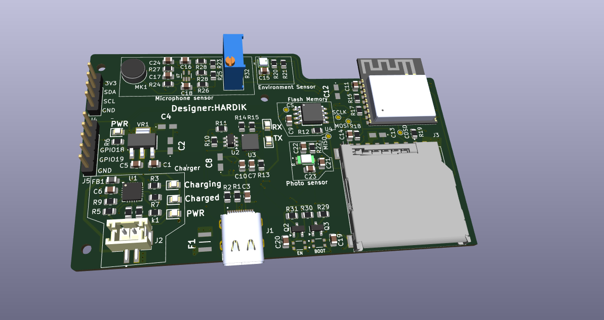

# ESP32-C3 IoT Development Board (4-Layer)


## 📋 Project Overview

This repository contains the hardware design files (KiCad) for a custom **4-layer IoT Development Board** powered by the **ESP32-C3-WROOM-02** module. 

Designed this compact board is an all-in-one solution for environmental sensing and data logging. It integrates power management for LiPo batteries, a suite of sensors (Environmental, Light, Audio), and dual storage options (SD Card + External Flash), making it ideal for low-power edge computing applications.

<p align="center">
  
</p>

## ✨ Key Features

*   **Microcontroller**: ESP32-C3-WROOM-02 (RISC-V 32-bit, WiFi 4 + Bluetooth 5 LE).
*   **4-Layer PCB**: Optimized stack-up for signal integrity and compact routing.
*   **Power System**: 
    *   **USB-C** for power and programming.
    *   **MCP73871** Li-Ion/Li-Poly Battery Charger with System Load Sharing (allows simultaneous charging and system operation).
    *   **LM1117-3.3** LDO for stable 3.3V regulation.
*   **Onboard Sensors**:
    *   **BME280**: Temperature, Humidity, and Barometric Pressure (I2C).
    *   **MAX4466**: Electret Microphone with Preamplifier (Analog Output).
    *   **TEMT6000**: Ambient Light Sensor (Analog Photo-transistor).
*   **Storage**:
    *   **MicroSD Card Slot** (SPI mode).
    *   **W25Q32** 32M-bit (4MB) External SPI Flash for logging/OTA.
*   **Connectivity**:
    *   **CP2102N** USB-to-UART Bridge with Auto-Program/Reset circuit (DTR/RTS logic).
    *   **I2C Header**: JST/Pin header for external OLED displays or sensors.

## 🔧 Hardware Specifications

| Component | Part Number | Interface | Description |
|-----------|-------------|-----------|-------------|
| **MCU Module** | ESP32-C3-WROOM-02-H4 | UART/SPI/I2C | Core processor, 4MB integrated flash |
| **USB Bridge** | CP2102N | USB 2.0 | USB to Serial converter |
| **Env. Sensor** | BME280 | I2C (Add: 0x76) | Precision Temp/Hum/Press |
| **Audio Amp** | MAX4466 | Analog (ADC) | Mic preamp with adjustable gain |
| **Light Sensor** | TEMT6000 | Analog (ADC) | Visible light spectrum sensor |
| **Charger** | MCP73871 | - | 1A Battery charger with Power Path |
| **Ext. Flash** | W25Q32JV | SPI | Additional 32Mbit storage |

## 🔌 Pinout & Interfaces

### User Interface (UI)
*   **Boot Button (SW1)**: Connected to GPIO9 (Strapping pin).
*   **Reset Button (SW2)**: Connected to EN (Enable).
*   **LED Indicators**: 
    *   Charging (Red)
    *   Charged (Green)
    *   Power/User (Blue)

### Expansion Headers
*   **J4 (I2C)**: `3V3`, `SDA`, `SCL`, `GND` - Designed for 0.96" OLED displays.
*   **J5 (GPIO)**: Breakout for spare GPIOs (GPIO8, GPIO18, GPIO19).

## 🛠️ Schematics

### Power Management
The power stage uses the **MCP73871** to manage USB and Battery power seamlessy. An **LM1117-3.3** provides the system voltage.


### Sensor Array
The board features a BME280 for environment data, a MAX4466 for audio processing, and a TEMT6000 for light detection.


### MCU & Storage
The ESP32-C3 is the heart of the board, interfacing with the SD Card and Flash memory via SPI.


## 🚀 Getting Started

1.  **Clone the repository**:
    ```
    git clone https://github.com/yourusername/ESP32-C3-IoT-Board.git
    ```
2.  **Open the Hardware Design**:
    *   Install [KiCad 9.0+](https://www.kicad.org/).
    *   Open `ESP32 project/ESP32 project.kicad_pro`.
3.  **Firmware Development**:
    *   The board uses the **CP2102N** bridge. Ensure drivers are installed.
    *   **PlatformIO / Arduino IDE**: Select board **"ESP32C3 Dev Module"**.
    *   **Auto-Upload**: The board includes the standard transistor reset logic, so no manual button pressing is required to upload code.


